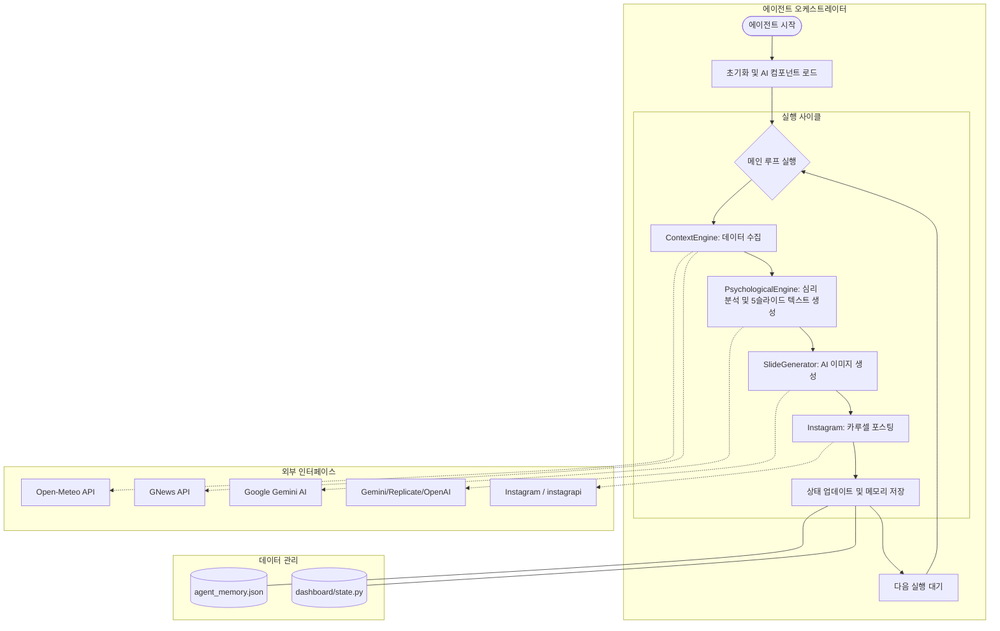

# 에이전트 시스템 분석 보고서

이 보고서는 `autogram-main` 프로젝트의 핵심 에이전트인 `AINewsAgent`와 그 주변 엔진들의 작동 구조를 분석하고, 잠재적인 문제점과 흐름도를 정리한 것입니다.

## 1. 시스템 아키텍처 및 흐름도 (Mermaid)

## 2. 주요 컴포넌트 상세 분석

### 2.1 ContextEngine (컨텍스트 엔진)
*   **역할**: 현재 날씨(Open-Meteo)와 뉴스(GNews)를 수집하여 포스팅의 '배경'을 만듭니다.
*   **작동 방식**: 
    *   서울 기준 날씨와 온도, WMO 코드를 가져와 한국어 시즌/날씨로 변환합니다.
    *   '직장인 번아웃', '커리어' 등의 키워드로 뉴스를 검색하며, 결과가 없을 경우 영어(US) 뉴스로 보완합니다.

### 2.2 PsychologicalEngine (심리학적 엔진)
*   **역할**: 빅터 프랭클의 의미치료(Logotherapy)와 스토아 철학을 기반으로 5페이지의 슬라이드 내용을 구성합니다.
*   **특징**: 
    *   Hook(P1) -> Context(P2) -> Insight(P3) -> Action(P4) -> Outro(P5)의 고정된 서사 구조를 가집니다.
    *   Gemini AI를 사용하여 페르소나를 유지하며 콘텐츠를 생성합니다.

### 2.3 SlideGenerator (슬라이드 생성기)
*   **역할**: 각 슬라이드 텍스트에 맞는 미니멀리즘 이미지를 생성합니다.
*   **특징**: 5개의 슬라이드를 병렬(`asyncio.gather`)로 생성하여 효율성을 높였습니다.

## 3. 발견된 잠재적 문제점 및 분석

분석 결과, 에이전트가 정상적으로 작동하지 않을 수 있는 몇 가지 핵심 포인트가 발견되었습니다.

1.  **Instagram 로그인 및 보안 차단**: `instagrapi` 라이브러리는 인스타그램의 비공식 API를 사용하므로, 잦은 로그인 시도나 자동화 활동이 감지되면 계정이 차단되거나 2단계 인증(2FA) 요구로 인해 포스팅 단계에서 실패할 확률이 매우 높습니다.
2.  **JSON 파싱 오류**: AI(Gemini)가 응답할 때 마크다운 형식을 섞거나 순수 JSON이 아닌 텍스트를 포함할 경우 파싱 에러가 발생할 수 있습니다. (현재 코드에 보완 로직이 있으나, AI의 응답 일관성에 의존적입니다.)
3.  **외부 API 의존성**: GNews, Open-Meteo, Gemini 등 다수의 외부 서비스를 사용하므로 네트워크 불안정이나 API 할당량 초과 시 에이전트 사이클이 중단될 수 있습니다.
4.  **이미지 생성 지연 및 비용**: 고해상도 이미지 생성을 위한 Replicate나 OpenAI API 사용 시 비용 문제와 생성 시간(대기 시간)이 사이클 전체 속도에 영향을 줍니다.
5.  **환경 변수 누락**: `.env` 파일에 `GEMINI_API_KEY`, `IG_USERNAME`, `IG_PASSWORD` 등이 정확히 설정되어 있지 않으면 초기화 단계에서 에러가 발생합니다.

## 4. 권장 조치 사항
*   **로그 모니터링**: `monologue_agent.log` 파일을 확인하여 어느 단계(COLLECTING, ANALYZING 등)에서 멈추는지 확인이 필요합니다.
*   **예외 처리 강화**: 인스타그램 포스팅 실패 시 대시보드에 정확한 오류 원인을 전달하도록 보완이 권장됩니다.
*   **계정 안전**: 인스타그램 로그인 시 세션 저장 방식을 도입하여 반복적인 로그인을 피해야 합니다.
